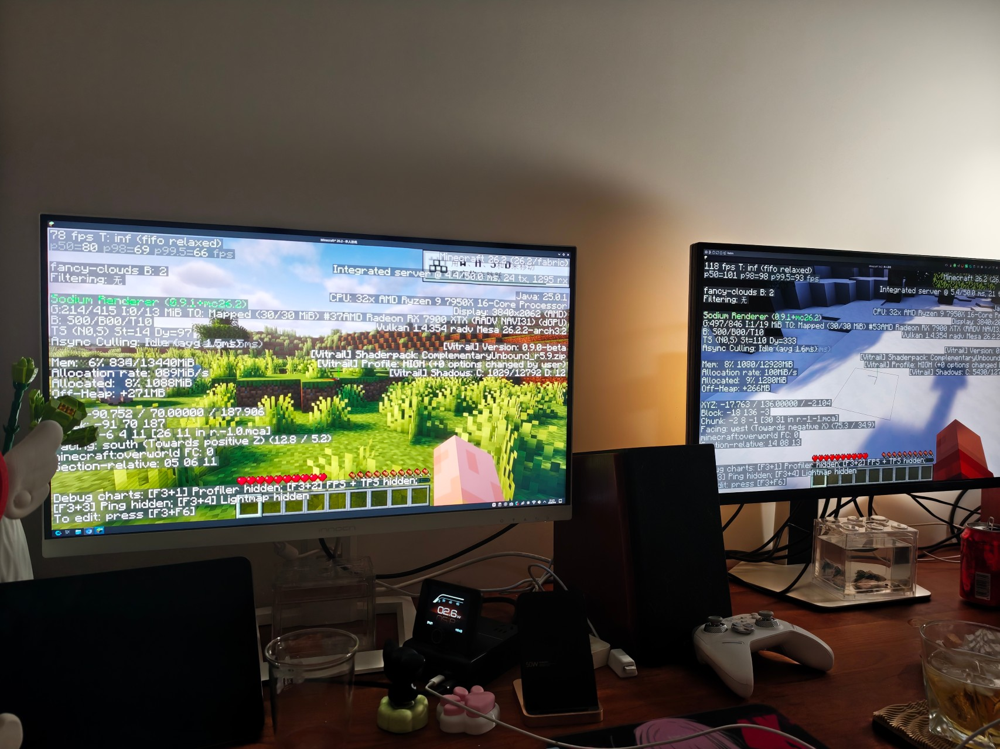
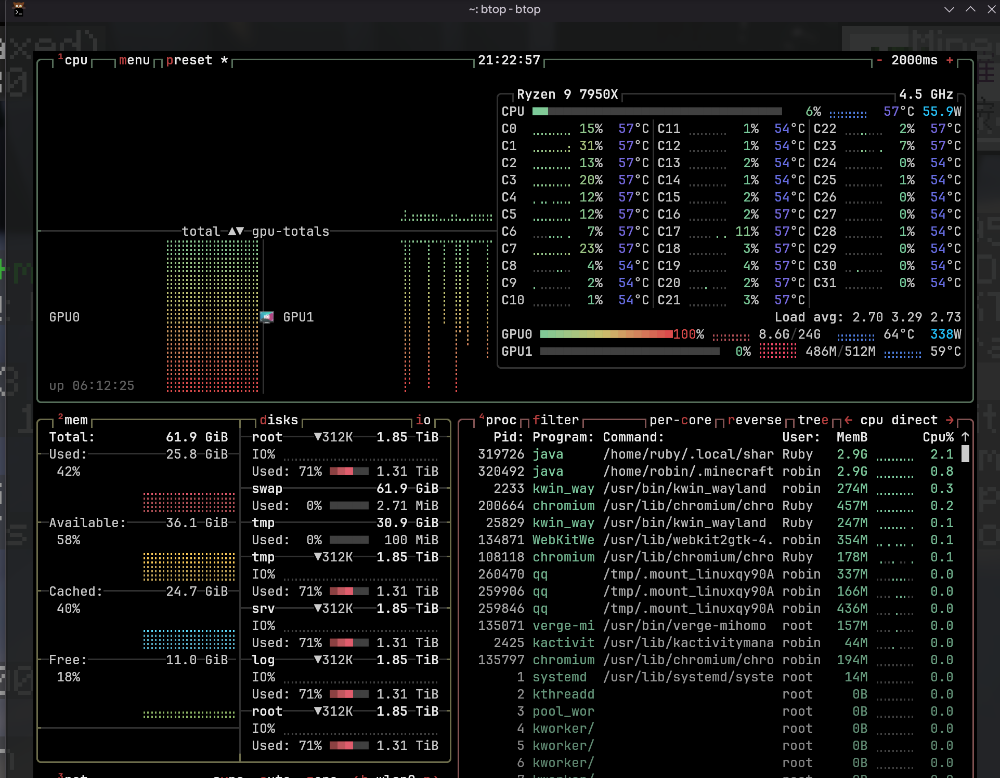
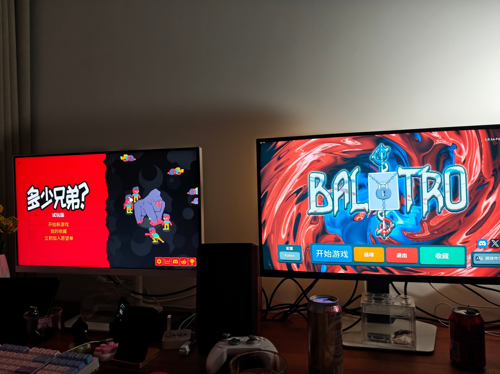

# 一台 Linux，两套键鼠，两个人同时用：CachyOS 本地双席位实录

> 2026-09-04

Windows 上有 ASTER 这类 multiseat 软件：一台主机接两套显示器、键盘和鼠标，两个人同时登录、同时使用。到了 2026 年，Linux 没理由做不到吧？

事实证明，Linux 确实做得到，而且标准组件已经覆盖了最重要的部分。真正折磨人的不是“启动两个桌面”，而是登录管理器、GPU 与音频设备归属，以及同一台显示器在两个席位之间切换时那些藏得很深的边界条件。

这篇文章记录一台 CachyOS 主机从设想到稳定落地的完整过程，包括走通的方案、失败的四线和软件借屏实验，以及最后为什么主动收敛成固定三线双席。

## 最终效果

主机硬件：

- Ryzen 9 7950X，带 Raphael 核显；
- RX 7900 XTX 24 GB；
- TCL 27C2A Pro 与 IOC 27M2V-D 两台 4K 高刷显示器；
- 两套独立键盘、鼠标。

最终分配：

| 席位 | 用户 | 桌面 | 显示 GPU | 显示器 |
|---|---|---|---|---|
| seat0 | robin | Hyprland 或 Plasma | RX 7900 XTX | TCL |
| seat1 | Ruby | Plasma Wayland | Ryzen 核显 | IOC |

两个人可以同时登录，键鼠互不串位。Ruby 的桌面由核显合成和输出，游戏则可以通过 PRIME Offload 交给 RX 7900 XTX 渲染。也就是说，“显示器接核显”不等于“只能用核显性能”。

## Linux multiseat 的核心不是虚拟机

这套方案没有运行虚拟机，也没有容器桌面。systemd-logind 原生支持多个 seat，每个 seat 拥有自己的：

- GPU KMS 设备；
- 显示器；
- 键盘和鼠标；
- 登录会话；
- 用户目录、D-Bus 与 systemd user manager。

设备通过 udev 规则持久分配给 `seat0` 和 `seat1`。两张 GPU 的 render node仍可被普通进程访问，所以第二席位可以跨 GPU 渲染：

```bash
MESA_VK_DEVICE_SELECT=1002:744c! vkcube
```

实测链路是：7900 XTX 渲染 → DMA-BUF 跨 GPU 传帧 → 核显 KWin 合成 → 主板 DP 输出。这比远程桌面或串流更直接，也不需要第二台客户端。

## 第一个坑：Plasma Login Manager 不是两个 greeter

最初使用 Plasma Login Manager。它能发现两个 logind seat，也会为两个席位创建 helper，看上去离成功只差一步。

问题是两个 helper 共用 `plasmalogin` 账号下的单实例 systemd user services。两个 greeter 会争抢同一组 KWin 与 Plasma 登录服务，结果只有一个席位能稳定显示登录页；重启后甚至出现 seat1 正常、seat0 黑屏的随机竞态。

这不是设备分配错误。GPU 和键鼠仍属于正确的 seat，失败发生在登录管理器的多 greeter 生命周期。

最终改用 Atrium。它面向 logind multiseat，会为每个 seat 启动独立 greeter，并能发现系统里的 Hyprland 与 Plasma Wayland 会话。实际重启后，两边登录、注销与并行会话都跑通了。

## 第二个坑：注销为什么要等四十秒

Plasma 注销后，Atrium 有时要近一分钟才重新出现。日志最后定位到：

```text
plasma-plasmashell.service
TimeoutSec=40
```

plasmashell 没有及时退出，systemd 一直等到 40 秒超时。给用户服务增加明确的退出命令和 5 秒停止超时后，注销恢复正常：

```ini
[Service]
ExecStop=/usr/bin/kquitapp6 plasmashell
TimeoutStopSec=5s
```

这个问题和 multiseat 没直接关系，但在频繁登录、注销测试时会被放大得非常明显。

## 第三个坑：想让一个人临时用双屏

双人使用时，两块屏各归一个席位；只有一个人时，主用户自然希望临时借走另一块屏。

显示拓扑最终采用三根线：

```text
RX 7900 XTX DP    → TCL    # seat0 主屏
RX 7900 XTX HDMI1 → IOC    # seat0 临时借屏
Raphael iGPU DP   → IOC    # seat1 固定主屏
```

正常双席模式下，TCL 显示 seat0，IOC 显示 seat1。我们曾尝试让 seat0 借屏：脚本先启用独显 HDMI 输出，再通过 DDC/CI 把 IOC 从核显 DP 切到独显 HDMI1；归还时反向执行。

IOC 的输入切换使用 VCP `0x60`：

```bash
# IOC 固件实际使用的 DP 值
ddcutil setvcp 60 0x08 --bus 4 --noverify

# IOC 固件实际使用的 HDMI 值
ddcutil setvcp 60 0x05 --bus 13 --noverify
```

DDC bus 会随当前输入变化，因此从 DP 切走时通过核显 DP 的 bus 13，下次从 HDMI 切回时通过独显 HDMI 的 bus 4。IOC 的 EDID capabilities 宣称标准值 `0x0f`/`0x11`，但固件会静默忽略，实测必须使用厂商值 `0x08`/`0x05`。

第一轮实验一度成功，但显示器切换输入时会真实撤销另一输入的 HPD，核显 DP 随即发生断连、重连与 LTTPR 链路训练。更糟的是，这不是简单的双击竞态：即便加入非阻塞锁、30 秒冷却，并把 watcher 缩减到只启停独显 HDMI，单次切换仍然可能令 KWin、PowerDevil/libddcutil 与 AMDGPU 的 hotplug/atomic 链路进入风暴，最终整机冻结。

另一类冻结来自脚本重新配置 TCL 的 4K160 输出：日志出现 `dsc2_enable`，继而 `vpg3_update_generic_info_packet` 持续超时。禁止脚本触碰 TCL 的 DP/DSC 状态解决了这一类问题，却没有解决 IOC 跨两张 GPU 选源的根本风险。

因此文章的最终方案**不再包含一键借屏**。桌面入口和底层 `seat0-dual` 动作都已停用，系统固定使用双人双席。需要临时切换面板输入时可以操作显示器 OSD，但物理选源只改变面板显示哪路信号，不会安全地替 Plasma 完成第二输出的加入与布局。

## 第四个坑：四根线为什么没有留下

为了让任意席位都能借用另一块屏，我曾增加第四根线：

```text
Raphael iGPU HDMI1 → TCL
```

理想状态是两张 GPU 都各接两台显示器，由软件控制 DP/HDMI 是否输出，让显示器自动选择仍有信号的输入。三种状态都能表达得很漂亮：双席、seat0 双屏、seat1 双屏。

现实是 Ruby 选择 Plasma Wayland 后，KWin 每次都在启动阶段失败：

```text
Applying output configuration failed!
There are no outputs - creating placeholder screen
```

Plasma 和 plasmashell 其实已经启动，只是 KWin 退到零输出占位屏。显示器继续保留 Atrium 的最后一帧，看起来就像登录界面卡死。

为了确认不是误诊，先后测试了：

- 删除并重建 `kwinoutputconfig.json`；
- IOC 从 4K 160 Hz 降到 4K 60 Hz；
- Cage 的 `last` 与 `extend` 模式；
- 登录前关闭 HDMI；
- 登录前同时启用 DP 与 HDMI；
- 调整 watcher 权限、席位识别和切换顺序。

结果始终一样。拔掉核显 HDMI 后，已经在后台运行的 Plasma 会立刻接管 IOC。

最有价值的对照实验是：完全相同的四根线，Ruby 改选 Hyprland 后可以正常启动并驱动核显双输出。这证明核显硬件、AMDGPU 驱动、接口带宽和 logind 分席本身都支持双屏；失败点是当前 KWin 6.7.4、Raphael 核显双连接器与 Atrium DRM 交接形成的特定组合。

但 Ruby 是这台机器的新手用户。一个需要学习 Hyprland 快捷键才能绕过显示兼容问题的方案，不算完成。最终删除第四根线，接受 seat1 不借用 TCL，换取 Plasma 每次都能可靠登录。

## 音频也必须分席

两个用户会各自启动一套 PipeWire 与 WirePlumber，但“进程独立”不代表“硬件自动隔离”。默认情况下，两边都枚举到了所有 ALSA 声卡：独显 HDMI、核显 HDMI，以及主板上的 `Generic USB Audio`。两个实例若选择同一张卡，就会争抢设备；Ruby 还看到了许多重复的 USB Output。

物理上实际只有三类输出：TCL、IOC，以及通过主板音频接口连接的漫步者。最终使用用户级 WirePlumber 规则按稳定的 `device.name` 过滤：

```ini
# robin 屏蔽 seat1 的核显 HDMI
{ device.name = "alsa_card.pci-0000_1a_00.1" }

# Ruby 屏蔽 seat0 的独显 HDMI 与主板 USB Audio
{ device.name = "alsa_card.pci-0000_03_00.1" }
{ device.name = "alsa_card.usb-Generic_USB_Audio-00" }
```

重启两边 PipeWire 后，robin 只看到 TCL 与漫步者，Ruby 只看到 IOC，重复节点也随之消失。验证时 Ruby 的 Chromium 流、PipeWire sink 和内核 ELD 都显示正常却没有声音；短暂播放左右声道测试音能够发声，最后发现只是 Chromium 应用流被静音。这也是排查数字音频的实用顺序：应用流 → PipeWire sink → ALSA/ELD → 显示器 OSD。

两席位现在可以同时播放，但应使用不同的物理输出。若要让两个用户共同输出到同一套漫步者，需要额外建立系统级混音或把一方的音频转发给另一方，会牺牲隔离性，不属于当前稳定方案。

## 最终验收：两个人同时跑 Vulkan Minecraft 光影

桌面、输入、显示和音频都稳定之后，最后一项验收是真实的双人游戏负载。robin 与 Ruby 分别启动自己的 Minecraft 26.2 Fabric 实例，两边使用同一套客户端组合：

```text
Fabric Loader 0.19.5
Fabric API 0.159.0+26.2
Sodium 0.9.1+mc26.2
Vitrail 0.9.0-beta+mc26.2
Complementary Unbound / High
Graphics API: Prefer Vulkan (Experimental)
```

这里容易混淆的是，Vitrail 不是 VulkanMod，也不是 Iris。Minecraft 26.2 自己提供实验性 Vulkan 后端，Vitrail 负责把传统 OptiFine 格式光影包转换并运行在这条后端上；它依赖 Sodium 0.9.x 和 Fabric API，不能与 Iris 混装。整个方案虽然使用 Vulkan 和复杂光影，却不是硬件光线追踪，并没有调用 7900 XTX 的 RT 单元。



实际同时运行时，robin 一侧最高约 130 FPS，Ruby 一侧最高约 90 FPS。Ruby 的帧率更低符合预期：robin 是独显直接输出，Ruby 则是 RX 7900 XTX 渲染、DMA-BUF 跨 GPU 传帧、Raphael 核显上的 KWin 合成、最后从主板 DP 输出。两个画面的视角和瞬时场景也不同，所以这组数字只能证明方案具备实际可玩性，不能直接把 90/130 的差值当作 PRIME 固有损耗。

系统监控给出了更关键的证据：属于 `robin` 与 `Ruby` 的两个 Java 游戏进程同时存在，RX 7900 XTX 达到 100% 利用率，显存约 8.6/24 GiB，功耗约 338 W。这意味着第二席位不只是“能看到 Vulkan 测试窗口”，而是真的与主席位并发使用同一张独显跑完整 Minecraft 光影负载。



显卡资源由驱动动态调度，并不会给两个人硬切成各 50%。满载时双方会互相影响帧时间，因此日常双人游玩更适合各自限帧，而不是让两边都无限帧把显卡长期顶到 100%。

为了判断 Ruby 少掉的帧数究竟来自哪里，我又读取了 Linux DRM 为每个进程提供的 `fdinfo` 引擎计数器。两边设置已经对齐：同为 4K160、scale 1.7、VSync、260 FPS 上限、12 区块距离，以及完全相同的 Sodium、Vitrail 和 Complementary 文件。两个 Minecraft 进程都只打开 7900 XTX 对应的 `renderD128`，所以 Ruby 并没有误跑到核显上；独显 PCIe 4.0 ×16 链路也处于满宽度。

10 秒增量采样的结果很有意思：

| 进程 | 独显 GFX | 独显 SDMA | 核显 GFX |
|---|---:|---:|---:|
| robin Minecraft | 69.8% | 0% | — |
| Ruby Minecraft | 27.3% | 76.2% | — |
| robin KWin | 2.0% | 0% | — |
| Ruby KWin | — | — | 29.7% |

Ruby 的高 SDMA 活动，加上 KWin 同时打开两张 GPU、在核显侧持有数百 MiB 跨设备共享显存，直接证明了每帧确实经过独显到核显的搬运。可是 76.2% SDMA 不能读成“损失了 76.2% GPU 性能”：SDMA 是可与 GFX 并行的搬运引擎。真正拉低 Ruby 帧率的是 buffer 导入、跨 GPU 同步和 present 反压——它在等待当前帧送到核显时不能持续提交下一帧，robin 的直出客户端便自然填补了空出的 GFX 时间。

这也不是 robin 获得了更高的系统优先级。两个 Java 进程同为 `nice -4`、`SCHED_OTHER`、实时优先级 0、动态优先级 23，也没有不同的 cgroup 权重。AMDGPU 不会因为一个进程属于 seat0 就自动偏爱它。

曾尝试用 MangoHud做 60 秒定量 A/B。第一份日志虽然得到 153.6 FPS 平均值，却是在游戏内 Esc 菜单下记录，GPU 平均负载只有 7%，显然不代表正常世界渲染；默认的“AFK 时降低帧率”还会在一分钟无输入后把游戏限制到 30 FPS。严格测量必须让两位玩家站在同一服务器、同一位置和朝向，固定天气与时间，把闲置限帧改成“仅最小化”，分别记录 robin 单开、Ruby 单开和双开三组。由于实际操作成本，本轮没有继续完成。

因此这里保留诚实的能力边界：现有数据证明 Offload 有真实的搬运和同步成本，也证明两个 4K 光影客户端会争抢同一张 GPU；它不能证明 Offload 单独损失 10%，更不能证明 Ruby 少掉的接近 40%全由 Offload 引起。对日常使用而言，给双方设置 80–90 FPS 上限，比追求一个脱离具体场景的固定损耗百分比更有价值。

HMCL 也从 robin 私有目录调整成了系统级共享程序：主体位于 `/opt/hmcl`，命令和应用菜单入口分别位于 `/usr/local/bin/hmcl` 与 `/usr/share/applications/hmcl.desktop`。共享的只有启动器程序；两人的 HMCL 设置、账号、Minecraft 实例、模组和存档仍留在各自家目录，不会互相覆盖。

同机联机时，服务端可以绑定 `0.0.0.0:25565`，表示监听所有本机 IPv4 接口。两个本机客户端的通信不经过物理网卡、交换机和外部局域网，确实省掉了物理网络传输；不过数据仍经过内核 TCP/IP、socket 缓冲区和 Minecraft 协议栈。严格来说，`0.0.0.0` 是服务端监听地址，客户端更规范的连接地址是 `127.0.0.1:25565` 或 `localhost:25565`；其他局域网设备则使用主机的 LAN 地址。

## Steam 家庭共享了，为什么已安装仍然是 0

Ruby 随后登录自己的 Steam 账号并加入 robin 的 Steam 家庭。游戏许可证已经出现，“已安装”数量却仍然是 0。原因并不在家庭共享：它只共享授权，不会跨 Linux 用户自动共享本机文件。Robin 的 26 个安装清单和约 599 GiB 游戏都在 `/home/robin/.local/share/Steam/steamapps`，而两个用户的家目录权限都是 `0700`，Ruby 本来就不应该读取 Robin 的私人 Steam 数据。

最直接的做法是把整个 Steam 库改成双方可写，但这对双席位并不安全。两个 Steam 客户端会同时接触 `appmanifest`、下载临时状态、Proton `compatdata` 与 shader cache；一边更新、验证或卸载时可能影响另一边正在运行的游戏。

这台机器的 `/home` 使用 Btrfs，于是采用 Reflink：只把 `steamapps/common/` 和 26 个 `appmanifest_*.acf` 克隆到 Ruby 自己的默认库。两套文件拥有独立的目录项和所有权，但初始引用相同的数据块；以后哪一边更新文件，Btrfs 才对发生变化的数据块执行写时复制。

克隆约 599 GiB 游戏本体只用了约 15 秒。`btrfs filesystem du` 显示两个逻辑目录约 592.08 GiB 数据共享，当时各自独占数据都是 0 B。Ruby 的文件所有权全部设为 `Ruby:ruby`，而两边的 Steam 客户端配置、Proton prefix、shader cache、下载状态和用户存档依旧分开。



最终两边已经同时启动各自的 Steam 游戏。这个结果比“共享一个可写库”更符合 multiseat 的边界：大体积只读内容通过文件系统复用，所有会变化、会加锁、带用户身份的状态仍按用户隔离。代价是 Reflink 不是实时同步；Robin 后装游戏时要再克隆给 Ruby，两边分别更新后也会逐渐产生独占数据块。

## 最后的取舍

最终方案没有实现最对称的功能，却实现了真正重要的目标：

- 两个人可以同时使用同一台 Linux 主机；
- 两套输入设备与桌面会话完全隔离；
- 第二席位不需要客户端；
- 第二席位可以共享高性能独显渲染；
- 两个席位已实测同时运行 Minecraft 26.2 Vulkan + Complementary 光影；
- Steam 家庭库通过 Btrfs Reflink 复用约 599 GiB 游戏本体，并已实测两边同时运行；
- 两席位的显示与音频设备都明确分配，不再争抢同一 ALSA 设备；
- 新手席位保留熟悉的 Plasma；
- 每次重启都有确定、可恢复的默认状态。

Linux multiseat 在 2026 年不是做不到，而是缺少 ASTER 那样把硬件差异、登录管理器和桌面合成器边界统一包起来的产品。标准组件已经足够强，但最后 10% 的集成仍然需要理解 DRM、logind、Wayland compositor 和显示器输入切换。

这次最重要的经验不是“Hyprland 比 KWin 强”，也不是“核显不能双屏”，而是不要把某个组合的 atomic modeset 失败误判成整个平台的能力边界，也不要把一次成功切换当成稳定性证明。把每一层拆开验证，最后才能知道应该修、应该绕，还是应该诚实地少要一个功能。
