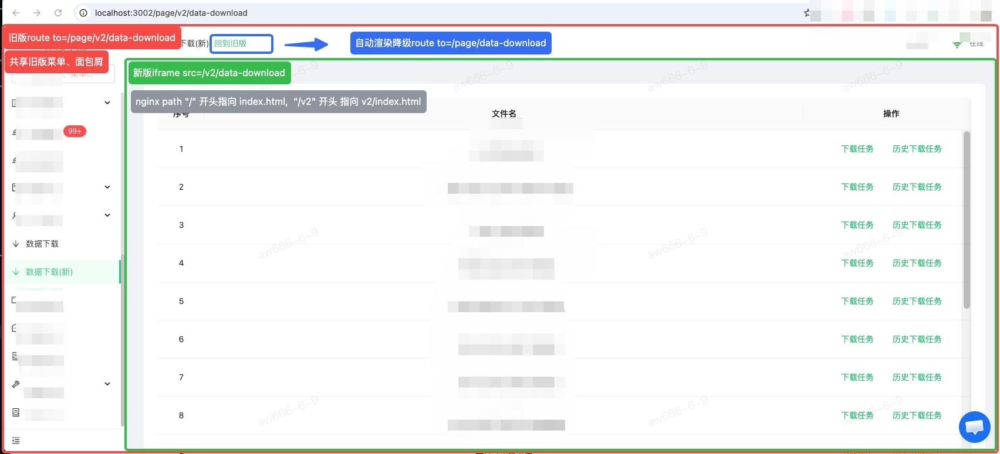

# 重生之路


## 现状

旧版 BI 前端基于 Umi 3 + dva + ProTable + Webpack 4 构建，React 16 + Ant Design 4，已运行多年。技术栈陈旧，构建慢，维护成本高。V2 项目旨在渐进式迁移到现代技术栈，不影响线上业务运行。

**分支：** `feature/v2`（基于 `release` checkout），共 30 个 commits。

## 选型

| 层面     | 选择                    | 理由                                          |
| -------- | ----------------------- | --------------------------------------------- |
| 构建工具 | **Rsbuild**             | Rspack 驱动，构建 ~0.7s（旧版 Webpack ~10min） |
| UI 框架  | **Ant Design 6**        | 延续旧版 antd 体系，迁移成本低                |
| React    | **19.1**                | 最新稳定版                                    |
| 路由     | **TanStack Router**     | 类型安全，文件路由可选                        |
| 数据请求 | **TanStack Query 5**    | 自动缓存/重试/loading，替代 dva effects       |
| 语言     | **TypeScript (strict)** | 类型安全                                      |
| 嵌入方式 | **iframe**              | 无感嵌入旧 SPA 侧边栏布局，同源共享 token     |

**不选 shadcn/ui 的理由：** 与旧版 antd 体系不兼容，增加迁移成本。

## 技术实现

### DevServer

```typescript
// rsbuild.config.ts
server: {
  port: 3000,
  proxy: { '/api': 'http://analysis.test' },
}

// 旧版 config.js
proxy: {
  // v2项目 rsbuild启动后地址
  '/v2': {
    target: 'http://127.0.0.1:3000/',
    // changeOrigin: true,
    pathRewrite: { '^/v2': '' },
  },
}
```

- 本地 `npm run dev` 启动 V2 开发服务器（port 3000）
- API 请求代理到 `analysis.test`，与旧 SPA 共享同一后端
- `server.base` 设为 `/v2`，开发模式静态资源路径与生产一致

### Nginx

```nginx
location /v2 {
    root /var/www;
    index index.html;
    try_files $uri $uri/ /v2/index.html;
}
```

- Docker 镜像内 `ADD dist-new /var/www/v2`
- 所有 `/v2/*` 路由 fallback 到 `/v2/index.html`（SPA 路由）
- 静态资源 `assetPrefix: '/v2/'` 确保 JS/CSS 路径正确
- API 请求 `/api/*` 由 nginx 反向代理到后端，V2 和旧 SPA 共用

### CI/CD

```
v2-build (Node 24, Rsbuild)
  → dist-new/
    → build-app-image (Docker, ADD dist-new /var/www/v2)
      → deploy-lfsz-dev (kubectl apply)
```

- `feature/v2` 分支手动触发部署到 dev 环境
- `develop` 分支自动部署

## 页面进展

### ✅ 已完成

| 页面/功能              | 状态 | 说明                                   |
| ---------------------- | ---- | -------------------------------------- |
| V2 项目脚手架          | ✅   | Rsbuild + React 19 + antd 6 + TanStack |
| 独立登录页 `/v2/login` | ✅   | 支持 2FA/密码修改 fallback             |
| 数据下载主页面         | ✅   | 24 种下载类型配置化，按权限过滤        |
| 定时任务管理弹窗       | ✅   | 查询 / 创建 / 编辑 / 删除              |
| 历史记录弹窗           | ✅   | 搜索 / 下载文件                        |
| iframe 嵌入旧 SPA      | ✅   | V2Wrapper + 高度同步 + 顶层跳转        |
| 面包屑"回到旧版"       | ✅   | `v1Path` 配置化，route 配一次自动生效  |
| Auth 体系              | ✅   | 同源共享 localStorage token，401 拦截  |
| API 层重构             | ✅   | 从 pages/ 迁移到 api/，零耦合          |
| CI/CD                  | ✅   | v2-build (Node 24) + Docker + dev 部署 |
| 主题支持               | ✅   | API 驱动的颜色查找                     |
| 架构文档               | ✅   | `v2/ARCHITECTURE.md`                   |
| 迁移可行性报告         | ✅   | `docs/migration-feasibility.md`        |

### 🔲 待实现

| 页面/功能        | 优先级 | 说明                                      |
| ---------------- | ------ | ----------------------------------------- |
| Token 自动刷新   | 高     | 401 时 `POST /api/authorizations/refresh` |
| 2FA 完整处理     | 中     | 登录页已有 fallback 提示，流程未完整      |
| 密码修改流程     | 中     | 登录页已有 fallback 提示，流程未完整      |
| 更多页面迁移     | 低     | 将旧版其他功能逐步迁移到 V2               |
| 旧版菜单默认切换 | 低     | "数据下载"默认指向 V2 iframe 版           |

## Q&A

### Q: 为什么用 iframe 而不是微前端（qiankun/single-spa）？

同源部署，iframe 是最简方案：

- 共享 localStorage（token 无缝衔接）
- 旧 SPA hash 路由不受影响
- 无需额外框架，零学习成本
- 侧边栏布局天然保留

### Q: `v1Path` 机制是怎么工作的？

1. 在 `router.config.js` 的路由定义中加 `v1Path: '/DataDownload'`
2. BasicLayout 用 `getAuthorityFromRouter` 匹配当前路由，读取 `v1Path`
3. 面包屑区域自动渲染"回到旧版"链接
4. 新增 V2 页面只需加一行 `v1Path`，无需改 BasicLayout

### Q: Token 怎么共享的？

V2 和旧 SPA 运行在同源下（同一域名），共享 `localStorage`：

- 旧 SPA 登录写入 `app_access_token` → V2 直接读取
- V2 登录页也可写入 → 旧 SPA 同样可用
- Token 格式兼容：JSON 对象（旧 SPA）和纯字符串

### Q: 构建有多快？

V2 (Rsbuild): **~0.7 秒** 旧版 (Webpack 4): **~2 分钟**

---

### Commit 记录（feature/v2 分支）

```
2864675ab chore(config): enable hidden-source-map devtool
95e1c54e3 feat(v2): add theme support with API-driven color lookup
05d95f38d feat(config): add v2 rsbuild dev server proxy
872ece841 fix(v2): set server.base to /v2 for dev mode asset paths
3949d9c2a feat(v2): add architecture doc and data download api
cb560d81b fix(FreightCount): remove unused SkuRerunLog usage
0e72733f6 refactor(sku): remove unused ProductStatisticsTable and related model code
d50a6e8cd chore: pin vite and vite-react-jsx to exact versions
04f8e9996 fix(vite): handle JSX syntax in .js files during vite dev
2daaf1af5 fix(config): remove duplicate config.local.js import
f90ac6a54 refactor: centralize v1Path in route config, read from matched route in BasicLayout
195b5c296 chore: remove redundant flex style from breadcrumb header
a24f2be2b fix: use Link + path mapping for breadcrumb 回到旧版 button
434b027bc fix: clean up TODO route name, add breadcrumb button to return to old version
ee4251180 feat(v2): implement iframe-based integration for V2 data download page
34f675a51 chore: remove stale styled-components@^5.3.0 from yarn.lock
1e809ef76 fix(ci): replace alpine images with bookworm (node:16-bookworm / 24-bookworm has curl pre-installed)
79759e5f0 Revert "fix: add styled-components dependency (used by AntdBaseTable)"
8fbf9c690 fix: add styled-components dependency (used by AntdBaseTable)
ad93e0ad4 feat(ci): allow feature/v2 to build docker image and deploy to dev
246010a0e fix(v2): set assetPrefix to /v2/ for correct static asset routing in production
59c4b0c6f fix(ci): use correct docker image path for v2-build (pre-commit fix)
ff667b367 feat(ci): add v2-build job (Node 24 + Rsbuild) to gitlab ci
18d598e93 fix(ci): deploy-lfsz-preview should deploy to dev environment
9eb107070 docs: add migration feasibility report
0912dae76 chore: add v2/dist to gitignore
1277b9fdb chore(deploy): update nginx and docker config for v2 spa
2c94932f7 feat(v2): data-download page migration (定时任务配置中心)
633f3563f feat(v2): add login page with auth context and api
cb15b4eca feat(v2): add core app structure with router and api client
```
