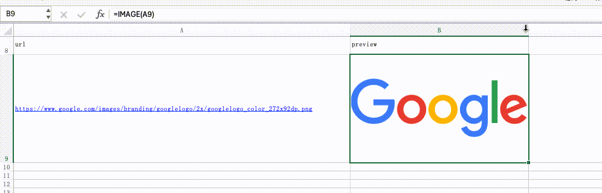
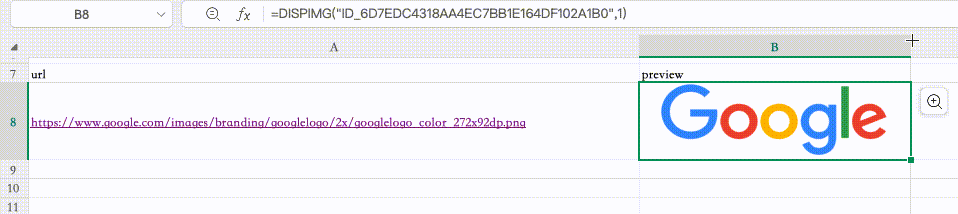
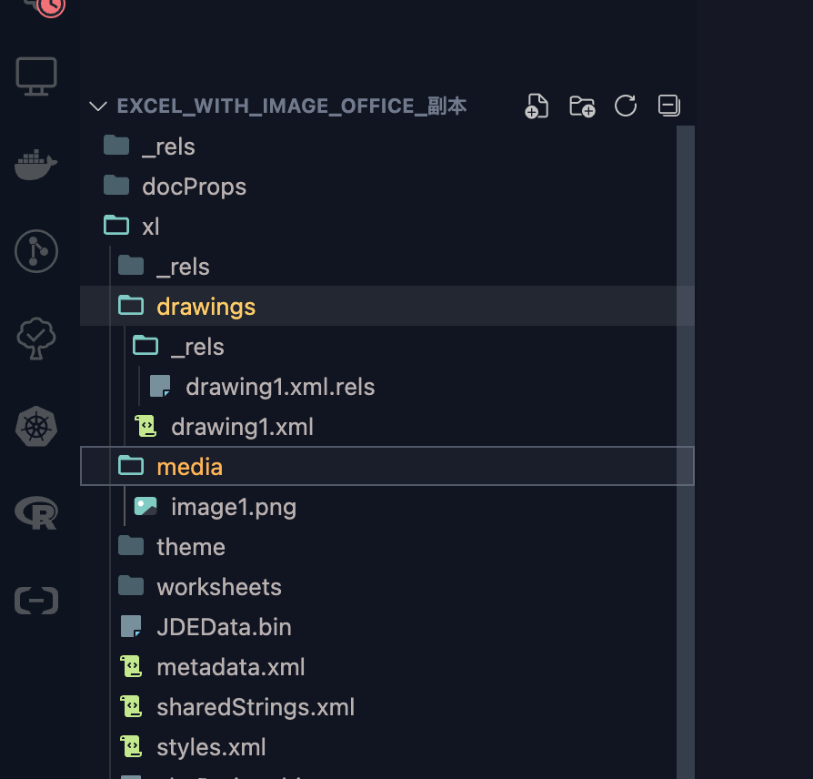
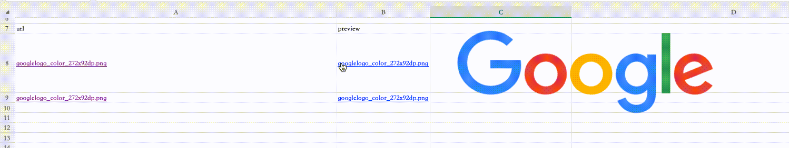

# Excel 导出图片的各类方案与利弊
> 2025-01-21


## 浮动式图片
这种做法是最常见也是兼容性最好的，项目中的后端实现也是如此。

但缺点在于，本质上，图片并不是在单元格内部，是根据定位实现的，可以被随意拖拽。

其大小也是需要人为调整到和单元格一致，才能达到像是放在单元格里一样。

自然也就做不到跟随单元格的缩放。

一些库会将这个动作封装成函数提供

https://xlswriter-docs.viest.me/zh-cn/dan-yuan-ge/cha-ru-ben-di-tu-pian


## Microsoft Office IMAGE()

支持从远端下载图片，需要执行 VBA 函数

好处是，可以通过函数直接拉取远端图片，并且是真正内嵌在单元格内，不存在定位问题，并支持随意缩放

但是只有 Microsoft Office 支持，估计是个专利功能



## WPS DISPIMG()
WPS有个丐版功能，同样也是 VBA 函数，也是 WPS 的专用功能

相比 Microsoft Office, 无法直接从远端拉取，必须事先将图片写入。

但同样是真正内嵌在单元格内，不存在定位问题，并支持随意缩放



考虑到 DISPIMG 并不是标准函数，实际在开发实现中会有比较大的困难。最差的情况，要先构建出基础的 XML，再根据 WPS 的标准, 实现 DISPIMG 需要读取的信息，最后再将 DISPIMG 作为公式写入到单元格内。

## 自定义 VBA

以上三种方案都有一个共同的缺点，那就是图片实际上是存在 Excel 中，如果图片过多，直接导致文件过大，操作卡顿等问题。

即便从存储原理上看，图片实际上是在 xlsx 压缩包里的一个文件，但 Excel 里还是需要大量的引用来保证图片的显示。

另外，当需要从 Excel 里取出图片的时候也十分的麻烦, 虽然可以解压拿到，但始终不是上策。



这里提出一个新的思路：

1. 利用超链接，将 Excel 和图片放在同一个文件夹下


2. 自定义一个 VBA 函数, 读取对应单元格的文件路径，利用浮动定位写到 Excel 中，切换到其他单元格时，移除这个图片，这样可以一直维持 Excel 文件小体积

```javascript
// WPS
let shape = null

async function _preview(url){
  if(shape){
    await shape.Delete();
    shape = null
  }
  shape = ActiveSheet.Shapes.AddPicture(url.Text, msoFalse, msoTrue, url.Left,  url.Top, -1, -1);
  return url.Text
}
```

效果如下


思路验证没问题后，再进一步，如果用户不喜欢这类的交互方式，可以考虑预加载

就是不依赖用户的悬浮显示图片，而是由全局的 VBA 进行控制，对可视区域内的图片进行加载，当区域变得不可见，则剔除图片

需要注意的是，Microsoft Office 和 WPS 在 VBA 的实现上是有差别的

