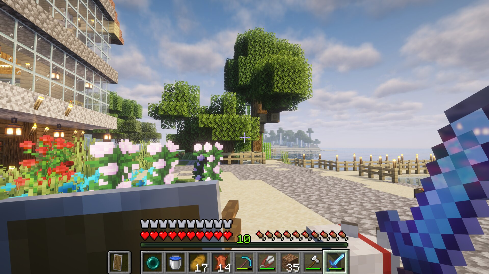

# 欢迎来服务器玩

> 2026-09-11

家里的 Minecraft 开着，海边这座玻璃房子也算有个像样的落脚点了。人不多，生存模式，想来就来。



地址直接填：

```text
robin-tech.top
```

Java 版，版本 **26.2**，Fabric。不用加端口，也不用写长子域名。

连不上的话，备用地址是 `game.robin-tech.top:25565`。开了 Clash TUN / fake-ip 的，把 `robin-tech.top` 加直连，或者用备用地址。

## 服务器什么样

生存，普通难度，没有白名单，最多 5 人。不强制登录微软账号。

模组都是省事用的，没有改玩法的大型整合：

- Veinminer：矿脉连挖
- FallingTree：树一棵棵倒
- Right Click Harvest：右键收菜
- Server Backpacks：背包
- TP Commands / Followers Teleport Too：传送相关

房子、路、海边的栏杆都是现挖现盖的，世界还很新。来了随便逛，别把别人刚铺的路挖穿就行。

我在线的时候 ID 是 `Robin_John`。不在线也能进，人走了服务器还在跑。
