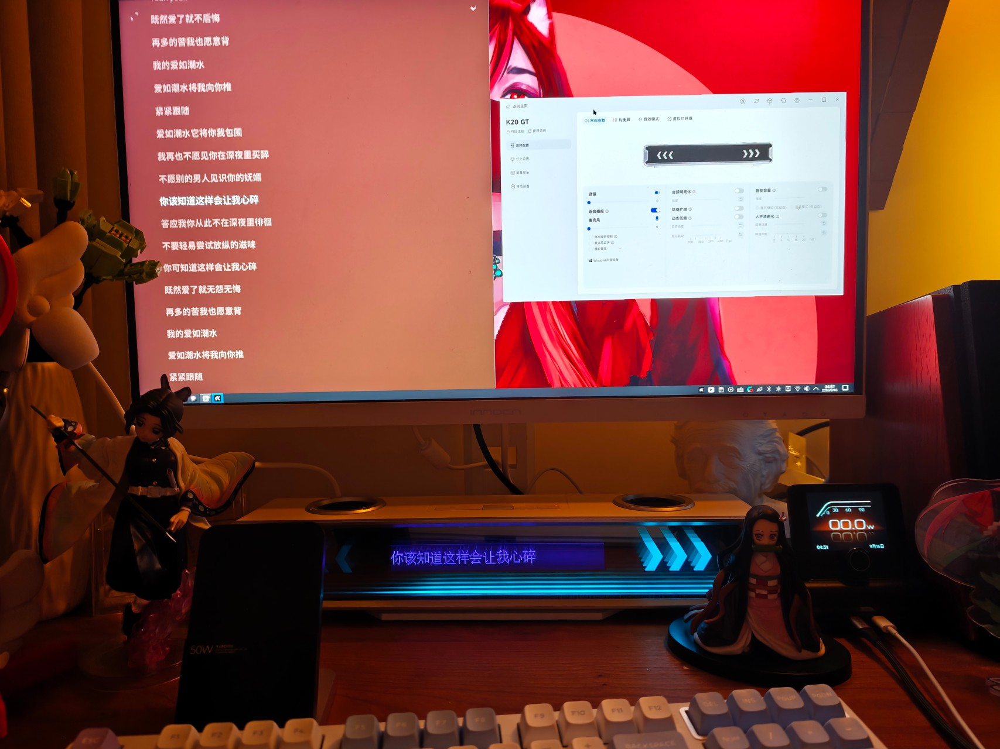

# 把 Windows 专属的 K20 GT 歌词屏搬到 Linux

> 2026-09-16

新接入的 MCHOSE K20 GT 是一条带屏幕的桌面音箱。声音本身在 Linux 下不难解决，真正吸引我的却是中间那块长条屏：官方宣传里它能显示歌词，但控制软件 M HUB 只有 Windows 版本，而这台机器上的音箱属于第二个 Linux 席位 Ruby。

最后的效果比预想中更完整：Ruby 在 YesPlayMusic 播放歌曲，左侧显示器展示滚动歌词，K20 GT 的屏幕同步显示当前行；M HUB 也能在 Wine 中识别音箱并打开完整设置页。



这张照片里的三块画面其实来自三套原本互不相通的系统：Linux 的 MPRIS 播放状态、Wine 中的 Electron 应用，以及通过 WebHID 控制的硬件屏幕。让它们串起来，远不只是“用 Wine 打开一个 exe”。

## 第一道坎：USB 已经接上，M HUB 却看不见

这台电脑是双席位：`robin` 使用主桌面，`Ruby` 使用另一套 Plasma 会话。K20 GT 接入后，最初尝试把整个 USB 设备挂到 Ruby 席位，但 udev 报错：设备缺少 `seat` 标签。

更麻烦的是，M HUB 的 Electron/Node USB 模块在 Wine 里无法正常初始化原生 libusb。Linux 明明能在 sysfs 中看到 `3837:60c6`，应用里却像什么都没插。

最终没有继续伪装完整的 Windows USB 栈，而是在 M HUB 的 `app.asar` 中加入了一个很窄的 Linux sysfs/HID 枚举桥。它只负责把系统已经识别出的 K20 GT 信息转换成应用期望的设备对象，再由 Linux 的 udev ACL 决定当前用户能否访问对应的 `hidraw` 节点。

这也避开了一个常见误区：多席位下真正需要隔离的是访问权限和音频路由，不一定要强迫每个 USB 父节点都拥有 seat 标签。

## 第二道坎：有设备，不等于有歌词

M HUB 识别音箱以后，频谱能显示，歌词却不会凭空出现。Windows 软件通常从本机播放器或平台接口获取歌曲信息；Linux 桌面这边最自然的数据源则是 MPRIS。

YesPlayMusic 已经发布了完整的 MPRIS 元数据：歌曲名、歌手、专辑、播放状态和当前位置都可以从 Ruby 的用户 D-Bus 中读到。于是链路变成了：

```text
YesPlayMusic
  → MPRIS
  → Ruby 用户服务 mchose-mpris-bridge
  → JSON 状态文件
  → M HUB preload IPC
  → WebHID
  → K20 GT 屏幕
```

歌词桥不是另起一个程序持续抢写 HID。那样做虽然偶尔能亮起来，却会和 M HUB 自己的打开、关闭及状态包竞争，最终导致画面退回频谱或者设备失联。后来出现的 `EBADF` 则是另一个完全独立的问题。

稳定方案是把兼容歌词包挂在 M HUB 原本的发送流程上：官方 cmd 39 发完后，再串行补发旧版 cmd 11。cmd 11 携带歌词开关、滚动状态、UTF-8 长度和当前歌词文本。只有一个发送队列，设备状态才不会互相踩踏。

## 最像硬件错误的一次，其实是 stderr

调试中最误导人的报错是：

```text
Error: open EBADF
```

它出现得正好又是在 USB/HID 改造之后，很容易让人认为是设备句柄打开失败。但完整 Electron 堆栈最终指向的是 `process.stderr`：Wine 启动的 Electron 继承了一个不可用的标准错误句柄，Node 在创建 writable stdio stream 时崩溃。

修复反而很朴素。所有桌面入口统一经过一个启动脚本，先把 stdout 和 stderr 重定向到普通日志文件，再启动 Wine。此后 `EBADF` 弹窗消失，日志也终于变得可追踪。

这次排查留下的经验是：错误发生在硬件功能附近，不代表它来自硬件。先看完整堆栈，再决定应该改 HID、Wine 还是 Electron。

## 歌词恢复后，整个 UI 又像被擦掉了一层

应用能打开后，MCHOSE 标志、标题栏按钮以及部分设备按钮没有文字，最典型的是“平铺视图”和“列表视图”只剩空位。它们看起来像缺少标签，其实根本不是文字，而是 iconfont 字形。

开发者工具显示 DOM、伪元素内容和颜色都存在，但 `iconfont` 与 MiSans 在 `document.fonts` 中处于 `error`。同一个官方 WOFF2 地址可以下载，也能被 `FontFace.load()` 正确解析，说明 Wine/Electron 环境中的首次字体加载失败后，页面没有重试。

M HUB 还不只有一层页面。窗口外壳使用 `mchose-renderer://`，设备详情来自远端 iframe；只修外壳，平铺和列表图标依然缺失。最终在外壳 `did-finish-load` 与设备 iframe 的 `did-frame-finish-load` 两个阶段都重新注册官方 iconfont 和 MiSans，图标才完整恢复。

音频页还有一道 Windows 管理员检测。在 Linux/Wine 下，实际权限由 udev ACL 管理，Windows UAC 检测没有意义，因此兼容层直接报告检测成功，但 M HUB 本身仍以 Ruby 普通用户运行，并没有让图形程序获得 root 权限。

## 双席位里的音频边界

K20 GT 属于 Ruby，不应该同时出现在 robin 的输出设备中；Ruby 也不该看到主席位上所有显卡 HDMI 和主板声卡节点。这里用两个用户各自独立的 PipeWire/WirePlumber 会话做设备过滤和默认路由，而不是让两个桌面争抢同一个全局音频服务。

这部分尤其容易被名称迷惑。系统显示的“模拟输出”只是 ALSA/PipeWire profile 的类别，并不代表 USB 音箱被降级成了劣质模拟链路；同样，一个物理声卡也可能因为 profile 和端口组合生成多个看起来重复的输出节点。最终应按物理设备、声卡 profile、sink 和实际播放流四层一起核对。

## 最终状态

现在这套方案已经完成冷启动验证：

- M HUB 从菜单或桌面图标启动，不再出现 `open EBADF`；
- K20 GT 能被 Wine 中的 M HUB 正确识别；
- 常规参数、均衡器、音效模式和虚拟 7.1 页面可以打开；
- 标题栏、侧栏、平铺/列表及设备详情图标正常；
- 不再错误提示需要 Windows 管理员权限；
- YesPlayMusic 播放中文歌曲时，K20 GT 会显示并更新当前歌词；
- 歌词桥与 M HUB 共用串行 HID 发送流程，不会再周期性退回频谱；
- Ruby 的音频输出仍由自己的 PipeWire 会话管理，不影响另一个席位。

从结果看，它只是桌面下方多了一行歌词；从实现看，却跨过了 USB 枚举、udev 权限、PipeWire 多席位隔离、MPRIS、Electron preload、iframe 字体和 HID 协议。Linux 桌面的乐趣大概就在这里：厂商没有提供路径，不代表硬件能力只能被锁在另一个系统里。
